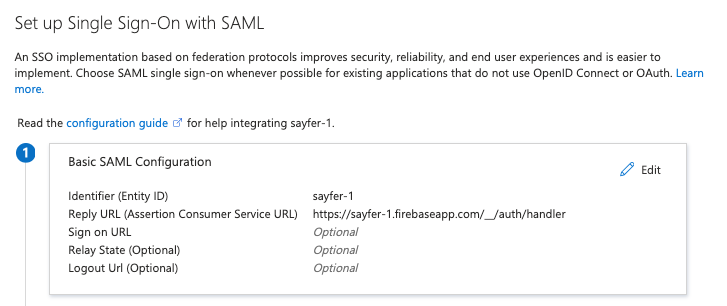

# מדריך חיבור SSO של הארגון ל Courtyard AI (באמצעות SAML)

להלן השלבים שהצוות הטכני / IT בארגון צריך לבצע על מנת לאפשר למשתמשים שלכם להתחבר ל Courtyard AI באמצעות ה־SSO הארגוני שלכם (Microsoft Entra / Azure AD).

## שלב 1 – יצירת אפליקציה ארגונית חדשה
1. היכנסו ל־Azure Portal
2. עברו אל: **Entra ID → Enterprise Applications**
3. לחצו **New application**
4. בחרו **Create your own application**
5. בחרו באפשרות: **Integrate any other application you don’t find in the gallery (Non-gallery)**

## שלב 2 – הגדרת SAML Single Sign-On
1. פתחו את האפליקציה החדשה
2. עברו ל־**Single sign-on**
3. בחרו **SAML**

במסך **Basic SAML Configuration** יש למלא:

- **Identifier (Entity ID)** → מסופק על־ידינו
- **Reply URL (ACS URL)** → מסופק על־ידינו

אין צורך למלא שדות נוספים אלא אם נדרש במדיניות הארגון.

דוגמה למסך ההגדרה ב־Azure — יש למלא את השדות לפי הערכים שאנו מספקים לכם:

## שלב 3 – שליחת נתוני ה־SAML חזרה אלינו
לאחר שמירה Azure יציג את הפרטים הבאים:

- **Login URL (SSO URL)** (ב־Azure מופיע לעיתים כ־**Login URL**)
- **Microsoft Entra Identifier** (ב־Azure: זהו ה־**Entity ID** של ה־IdP, בדרך כלל בצורת `https://sts.windows.net/<tenant-id>/`)
- **X.509 Certificate (Base64)** – ניתן להוריד כקובץ

אנחנו זקוקים לשלושת הערכים הללו כדי להשלים את ההגדרה בצד שלנו.

נא לשלוח לנו:
1. קובץ ה־Certificate  
2. ה־Login URL  
3. ה־Microsoft Entra Identifier (Entity ID של ה־IdP)  

## שלב 4 – הגדרת Claims (חשוב)
במסך **Attributes & Claims** יש להגדיר:

| Claim | Value |
|-------|--------|
| email | user.userprincipalname |
| name | user.displayname |
| given_name | user.givenname |
| family_name | user.surname |

אם בארגון שלכם שדות הדוא״ל שונים – אנא עדכנו אותנו.

## שלב 5 – ניהול גישה
במסך **Users and Groups**  
יש להוסיף את כלל המשתמשים או הקבוצות שאמורים לקבל גישה לאפליקציה.

---

## זה הכול!
לאחר קבלת הנתונים, אנו נשלים את ההגדרה בצד שלנו (Firebase), והמשתמשים שלכם יוכלו להתחבר עם ה־SSO הארגוני.
